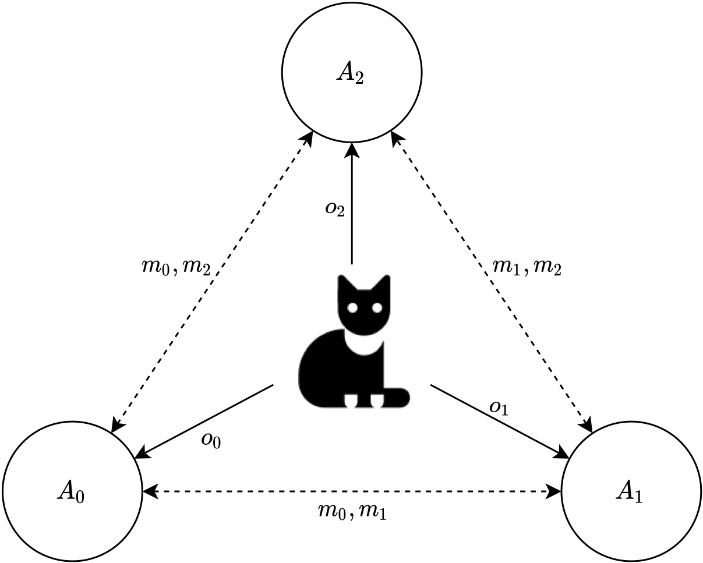
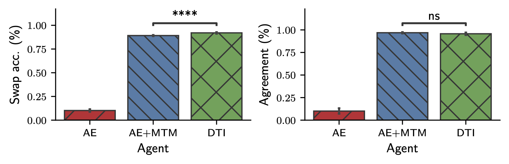
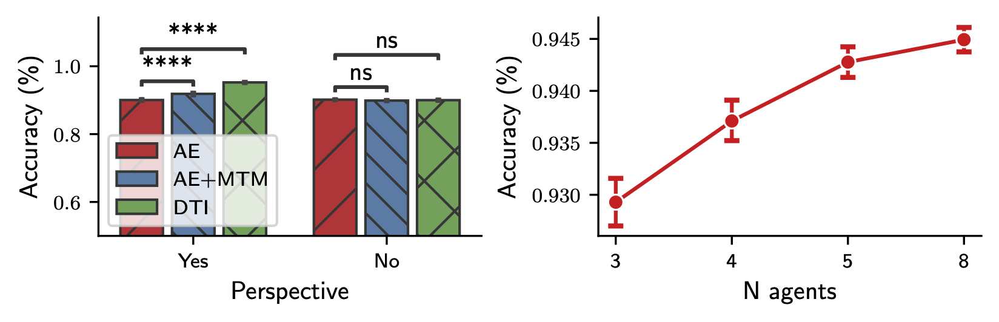

# Learning To Improve Representations by Communicating About Perspectives

This is the code repository for our paper "Learning To Improve Representations by Communicating About Perspectives", which is currently under review at NeurIPS 2021. A prelimiary version of the paper can be found [here](https://drive.google.com/file/d/12jiAi9Xqq04RYj-vWK_z2wapRaOaQdqO/view?usp=sharing), though it is subject to a lot of changes in the near future.

## At a glance
We link emergent multi-agent communication with representation learning. Using downstream task performance as a metric, we find that when agents use their representations not only to _represent_ data but also use them to communicate, the learned representations are better then if they were not encouraged to use them in communication.

**Methods:** We use multiple convolutional autoencoders and use a range of loss functions that encourage the alignment of latent representations during training. 

## Results

